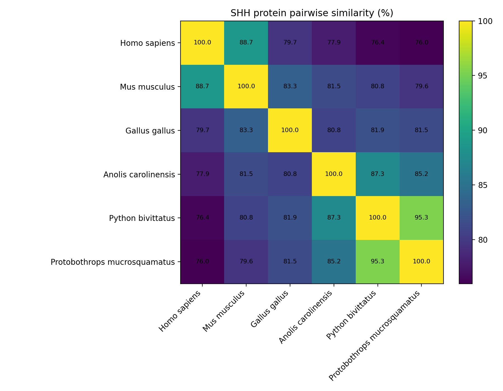
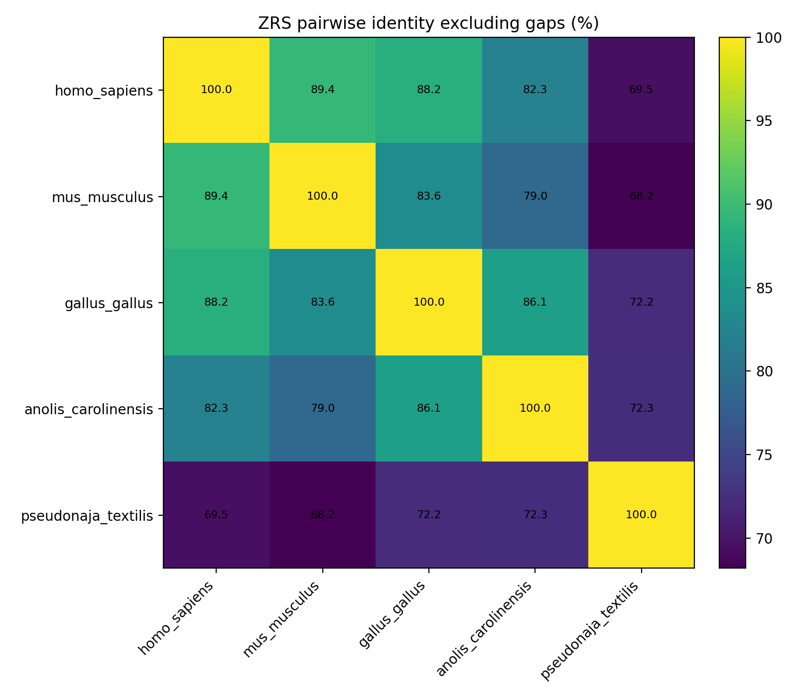
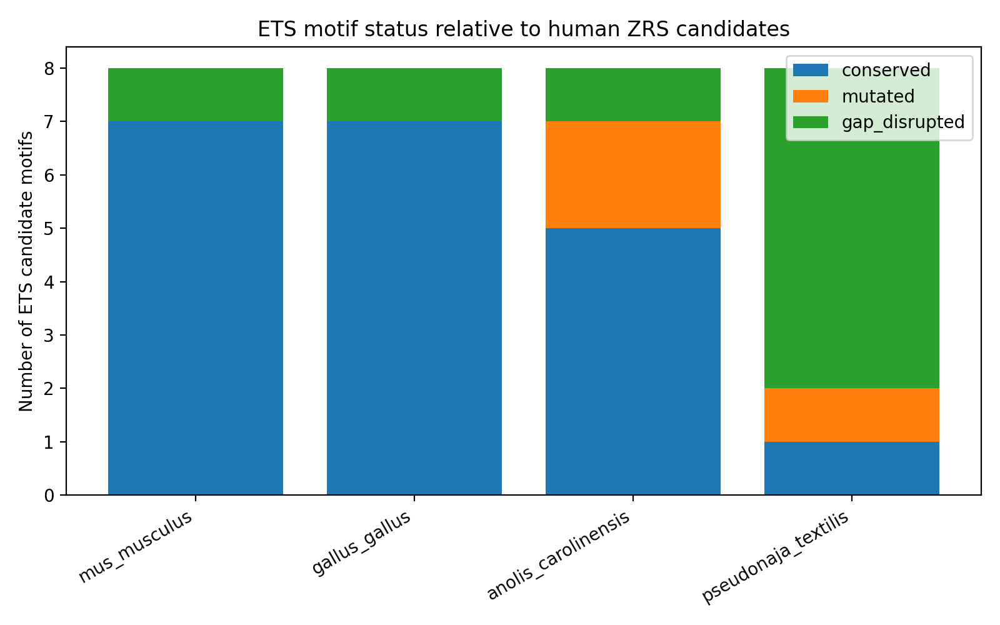

# Snake Limb Loss: SHH Protein Conservation and ZRS Enhancer Motif Analysis

This repository contains a small comparative genomics project on snake limb loss. The project asks whether snake limb reduction is more likely explained by changes in the **SHH protein-coding sequence** or by changes in a **non-coding regulatory enhancer**, especially the ZRS limb enhancer near *SHH*.

## Research question

Do snakes show major sequence-level divergence in the Sonic hedgehog protein, or is the stronger signal found in the ZRS enhancer that regulates limb-specific *SHH* expression?

## Main idea

The analysis is built around a two-step hypothesis test.

1. **Protein-level test:** compare SHH protein sequences across vertebrates.
2. **Regulatory-level test:** compare a human ZRS enhancer window across vertebrates and scan ETS-core motif candidates.

If the SHH protein remains conserved in snakes but ZRS enhancer motifs are disrupted, the result supports a regulatory-change hypothesis rather than a simple protein-loss hypothesis.

## Dataset

### SHH protein sequences

The SHH protein FASTA file contains six vertebrate sequences retrieved from NCBI.

| Species | Group | Accession | Length |
|---|---|---:|---:|
| Homo sapiens | Mammal | NP_000184.1 | 462 aa |
| Mus musculus | Mammal | NP_033196.1 | 437 aa |
| Gallus gallus | Bird | NP_990152.1 | 425 aa |
| Anolis carolinensis | Lizard | XP_003221976.1 | 427 aa |
| Python bivittatus | Snake | XP_007433256.1 | 426 aa |
| Protobothrops mucrosquamatus | Snake | XP_015688035.1 | 426 aa |

### ZRS enhancer alignment

The ZRS enhancer analysis uses a human reference window near *SHH*:

```text
homo_sapiens 7:156791102-156791874
```

The Ensembl PECAN amniote alignment contains five species:

```text
homo_sapiens
mus_musculus
gallus_gallus
anolis_carolinensis
pseudonaja_textilis
```

## Repository structure

```text
snake-limb-loss-shh-zrs-analysis/
├── README.md
├── requirements.txt
├── data/
│   ├── shh/
│   │   ├── accessions.csv
│   │   └── shh_selected.fasta
│   └── zrs/
│       ├── zrs_5species_aligned.fasta
│       └── zrs_5species_ungapped.fasta
├── results/
│   ├── shh_pairwise_similarity.csv
│   ├── zrs_pairwise_stats.csv
│   ├── zrs_sequence_lengths.csv
│   ├── zrs_ETS_motif_scan.csv
│   └── zrs_ETS_motif_summary.csv
├── figures/
│   ├── shh_similarity_heatmap.png
│   ├── zrs_pairwise_identity_heatmap.png
│   └── zrs_ets_motif_status.png
├── src/
│   ├── fetch_shh_sequences.py
│   ├── summarize_shh_sequences.py
│   ├── calculate_shh_similarity.py
│   ├── download_zrs_alignment.py
│   ├── scan_zrs_ets_motifs.py
│   └── visualize_results.py
├── notebooks/
│   └── snake_analysis.ipynb
└── docs/
    └── project_summary_ko.md
```

## Workflow

```bash
pip install -r requirements.txt
```

To reproduce the SHH protein analysis:

```bash
python src/fetch_shh_sequences.py --email your_email@example.com
python src/summarize_shh_sequences.py
python src/calculate_shh_similarity.py
```

To reproduce the ZRS enhancer analysis:

```bash
python src/download_zrs_alignment.py
python src/scan_zrs_ets_motifs.py
python src/visualize_results.py
```

## Results

### 1. SHH protein is relatively conserved across vertebrates

The SHH protein comparison shows high similarity between the two snake species and moderate-to-high similarity between snakes and other vertebrates.

Key examples from the pairwise SHH protein comparison:

| Species 1 | Species 2 | Similarity |
|---|---|---:|
| Python bivittatus | Protobothrops mucrosquamatus | 95.31% |
| Anolis carolinensis | Python bivittatus | 87.35% |
| Homo sapiens | Python bivittatus | 76.41% |
| Homo sapiens | Protobothrops mucrosquamatus | 75.97% |



This result weakens the idea that snake limb loss was mainly caused by a complete loss of SHH protein function.

### 2. ZRS enhancer identity is lower in snake compared with other vertebrates

The ZRS alignment shows a stronger divergence signal in *Pseudonaja textilis* than in mouse, chicken, or anole when compared with human.

| Comparison with human | Ungapped identity |
|---|---:|
| human vs mouse | 89.37% |
| human vs chicken | 88.17% |
| human vs anole | 82.32% |
| human vs Pseudonaja textilis | 69.46% |



### 3. ETS motif candidates are frequently disrupted in snake ZRS

The ETS-core motif scan identified eight human reference ETS candidate sites. In *Pseudonaja textilis*, only one of eight was conserved, one was mutated, and six were gap-disrupted.

| Species | Conserved | Mutated | Gap-disrupted | Total |
|---|---:|---:|---:|---:|
| mus_musculus | 7 | 0 | 1 | 8 |
| gallus_gallus | 7 | 0 | 1 | 8 |
| anolis_carolinensis | 5 | 2 | 1 | 8 |
| pseudonaja_textilis | 1 | 1 | 6 | 8 |



## Interpretation

The combined result suggests the following pattern:

```text
SHH protein sequence: relatively conserved
ZRS enhancer sequence: more disrupted in snake
ETS-core motif candidates: strongly disrupted in Pseudonaja textilis
```

Therefore, this project supports the hypothesis that snake limb reduction is more plausibly connected to changes in *SHH* regulation than to loss of the SHH protein itself.

## Limitations

This project is a comparative sequence analysis, not a functional experiment. Motif disruption does not automatically prove loss of enhancer activity. Also, only a small number of species and a limited set of ETS-core motifs were analyzed. Experimental validation would require reporter assays, gene expression data, or broader comparative genomics.

## Biological significance

This project shows how bioinformatics can connect protein conservation, non-coding regulatory sequence evolution, and evolutionary developmental biology. It also demonstrates why coding sequences and enhancers should be analyzed separately when studying morphological evolution.
